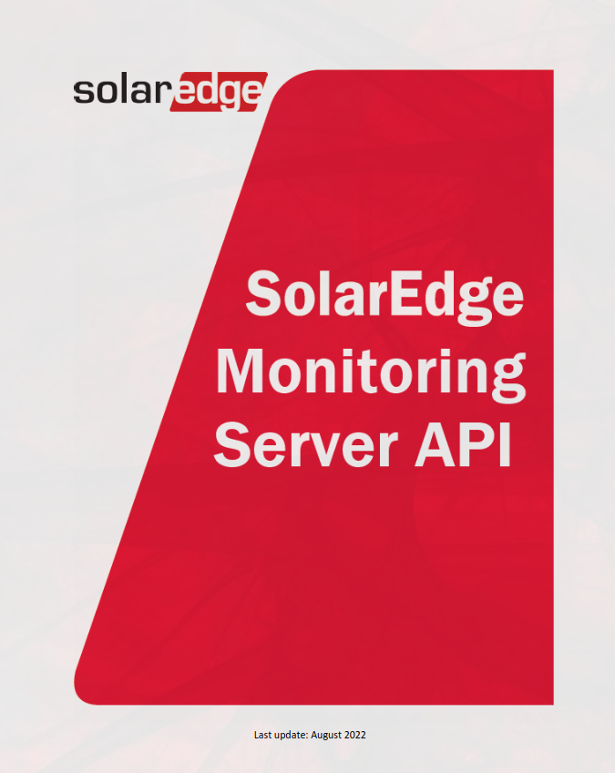

# API Documentation Summary

| Link                                 | Description                            |
|--------------------------------------|----------------------------------------|
| [Introduction](Introduction.md)      | Introduction to the API                 |
| [API Version](API-version.md)        | Information about the API version      |
| [Components](Components.md)          | Overview of installation components         |
| [Details](Details.md)                | Detailed information about the installation |
| [Energy](Energy.md)                  | Energy-related information             |
| [Inventory](Inventory.md)            | Inventory management details            |
| [Meters](Meters.md)                  | Information about meters                |
| [Overview](Overview.md)              | General overview of the installation        |
| [Power](Power.md)                    | Information about power                |
| [Sensors](Sensors.md)                | Details about sensors                  |
| [Storage](Storage.md)                | Storage-related information            |

